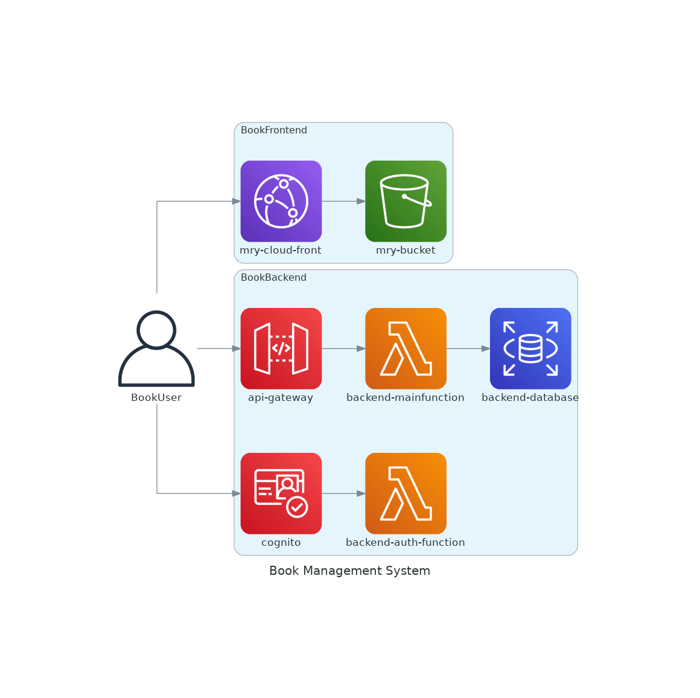

# BookLambda

-   designed to manage reading records.
-   meant to be developed inside a docker container, needless to install any dependencies.
-   able to run locally as an RestAPI or deploy as an AWS lambda function.
-   authentication relies on the AWS Cognito

-   Available user account for demo
    -   UserName: test Password: Test1234!

## Tech Stack

### Frontend

-   Angular

### Backend

-   C#.NET8
-   MySQL/PostgreSQL
-   EntityFramework

## System diagram

  

## Development Commands

-   Run backend services

    `docker-compose up`

-   Restart backend service

    `docker-compose restart backend`

## Migration Commands

-   Add a migration file

    `dotnet ef migrations add <Migration Name> --project Book_EF/Book_EF.csproj --startup-project Book_Lambda/src/Book_Lambda.csproj`

-   Remove migrations

    `dotnet ef migrations remove --project Book_EF/Book_EF.csproj --startup-project Book_Lambda/src/Book_Lambda.csproj`

-   Output a SQL script of migrations

    `dotnet ef migrations script --project Book_EF/Book_EF.csproj --startup-project Book_Lambda/src/Book_Lambda.csproj -o initial.sql`

-   Run migration

    `dotnet ef database update --project Book_Lambda/src/Book_Lambda.csproj`

-   Drop Database

    `dotnet ef database drop --project Book_Lambda/src/Book_Lambda.csproj`

## File Format Commands

-   Apply format

    `dotnet format`

## Build Commands

-   Debug build

    `dotnet build`

-   Publish build for Lambda environment

    `dotnet publish -c Release -r linux-x64`
